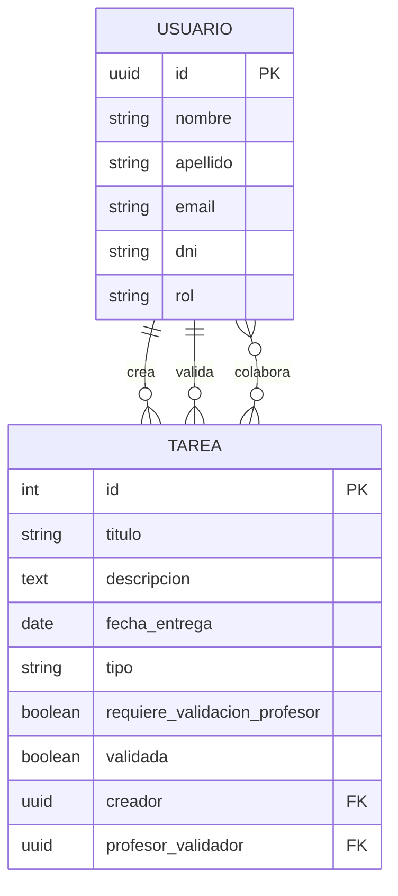

# 📘 Gestión de Tareas – Proyecto Django + PostgreSQL

Aplicación web desarrollada en Django para la gestión de tareas en un entorno educativo.  
El sistema diferencia entre **alumnado** y **profesorado**, permitiendo a cada rol realizar acciones específicas según el enunciado de la práctica.

Este proyecto demuestra:

- Modelado de datos complejo con **relaciones avanzadas en Django ORM**
- Manejo de **formularios con validaciones personalizadas**
- Configuración y uso de **PostgreSQL** como motor de base de datos
- Aplicación de **migraciones**, incluyendo datos iniciales
- Separación clara de responsabilidades entre roles
- Buenas prácticas de desarrollo y control de versiones

---

# 🧩 Funcionalidades principales

## 👨‍🎓 Rol Alumno
- Crear tareas **individuales** o **grupales**
- Indicar si una tarea requiere o no validación del profesor
- Validar directamente las tareas **no evaluables**
- Ver:
  - Tareas creadas por él
  - Tareas en las que colabora

## 👨‍🏫 Rol Profesor
- Validar tareas que requieren evaluación
- Ver todas las tareas pendientes de validar
- Consultar datos propios y del alumnado/profesorado

---

# 🗂️ Modelado de datos

El sistema se basa en dos entidades principales:

### **Usuario**
- Identificado mediante **UUID**
- Campos personales: nombre, apellido, email, DNI
- Rol: `ALUMNO` o `PROFESOR`
- Validación personalizada del DNI

### **Tarea**
- Título, descripción y fecha de entrega
- Tipo: `INDIVIDUAL` o `GRUPAL`
- Propiedad `requiere_validacion_profesor`
- Estado único: `validada`
- Relaciones:
  - `creador` → FK a Usuario
  - `profesor_validador` → FK a Usuario
  - `colaboradores` → ManyToMany con Usuario

---

# 🗺️ Diagrama de tablas (MermaidJS)

> **Nota:** Aunque el diagrama muestra que cualquier usuario podría crear o validar tareas, la lógica de negocio implementada en Django restringe estas acciones según el rol.

---

# 🧠 Decisiones de diseño

### Separación de roles
Inicialmente se planteó que profesores también pudieran crear tareas, pero el enunciado especificaba que solo los alumnos debían hacerlo. Por ello se separaron claramente las vistas y acciones de cada rol.

### Vistas independientes
Aunque se valoró usar condicionales en una sola vista, finalmente se optó por separar:

- `mis_tareas.html` (alumno)
- `tareas_a_validar.html` (profesor)

Esto mejora la claridad, evita lógica compleja y facilita la navegación.

### Estado único de las tareas
El enunciado hablaba de “validar”, no de “completar”.  
Por ello se eliminó el estado “completada” y se unificó todo en un único campo: **validada**.

### Tipo “evaluable”
Aunque el enunciado lo menciona como tipo, se decidió implementarlo como **propiedad**, permitiendo que tanto tareas individuales como grupales puedan ser evaluables o no.

### Uso de UUID como clave primaria
Se eligió UUID para el modelo Usuario por:

- Mayor seguridad  
- No predictibilidad  
- Buenas prácticas recomendadas en entornos multiusuario  
- Evitar IDs secuenciales expuestos (1, 2, 3…)

### ManyToMany para colaboradores
Una tarea puede tener múltiples alumnos colaboradores, y un alumno puede colaborar en varias tareas.  
Además, el creador se añade automáticamente como colaborador.

### PostgreSQL + .env
Se configuró PostgreSQL según el enunciado.  
Las credenciales se gestionan mediante `.env`, lo que:

- Evita exponer datos sensibles  
- Facilita despliegues en distintos entornos  
- Sigue buenas prácticas profesionales  

---

# 🧪 Flujo de trabajo y commits

El desarrollo se realizó de forma incremental:

- Creación inicial de la app `usuarios`
- Implementación de formularios y validaciones
- Desarrollo de la app `tareas`
- Separación de vistas por rol
- Refactorización del estado de las tareas
- Ajustes de UI/UX y navegación
- Commits frecuentes reflejando cada avance

El repositorio muestra claramente la evolución del proyecto y las decisiones tomadas.

---

# 🔗 Enlace al proyecto

👉 **[Repositorio en GitHub](https://github.com/eloycompes/DWES-UT04)**
